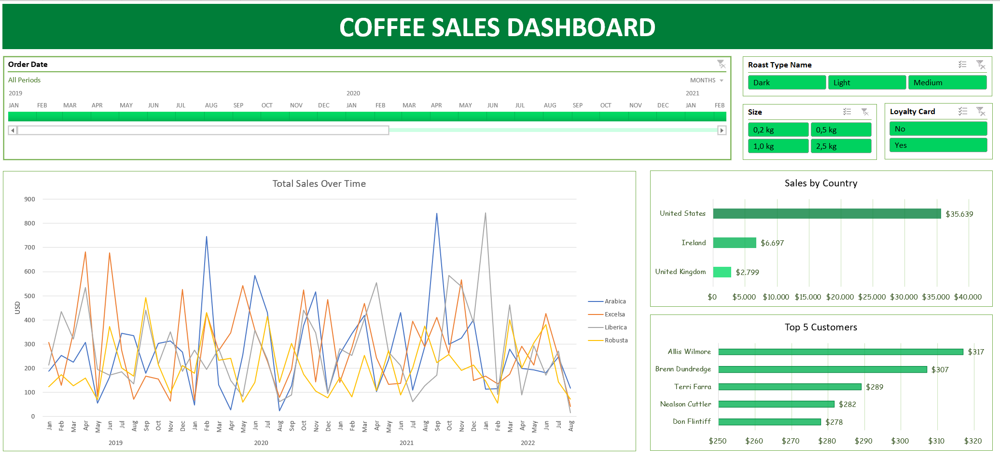

# ☕ Coffee Sales Dashboard

This project showcases an **interactive Excel dashboard** for analyzing coffee sales data.  
It demonstrates the use of advanced Excel features including formulas, formatting, and visualization tools.

## 📸 Preview Dashboard

## 🚀 Demo
- [View the Excel file on OneDrive](https://1drv.ms/x/c/f108fa9e0dfd42e4/EYwgdoJIFf1Nguyxc9HBAtQBd6oE2My5SlpGoHknyfcgzQ?e=CDAc9T)  

## 🛠️ Steps Performed
During this project, the following steps were taken to transform raw data into an interactive dashboard:

1. **Data Preparation & Cleaning**
   - Applied **XLOOKUP** and **INDEX-MATCH** for dynamic lookups
   - Used **Multiplication formulas** for sales calculations
   - Built **Multiple IF formulas** for conditional logic
   - Performed **date formatting** and **number formatting** for consistency
   - Checked for and removed **duplicates**

2. **Data Structuring**
   - Converted raw **ranges to Excel Tables** for better structure
   - Created **Pivot Tables** for aggregated analysis
   - Added **Pivot Charts** with formatting for visualization

3. **Dashboard Building**
   - Inserted **Timeline filters** for date-based navigation
   - Added **Slicers** for interactive filtering (Roast type, Size, Loyalty card, etc.)
   - Designed and formatted the **Coffee Sales Dashboard** combining all insights

## 📊 Key Insights
- **Total Sales Over Time** → trend of sales from 2019–2022  
- **Sales by Country** → performance across different markets  
- **Top 5 Customers** → highest spending customers  
- **Filterable Dashboard** → explore data by roast type, size, loyalty card, and time period  
